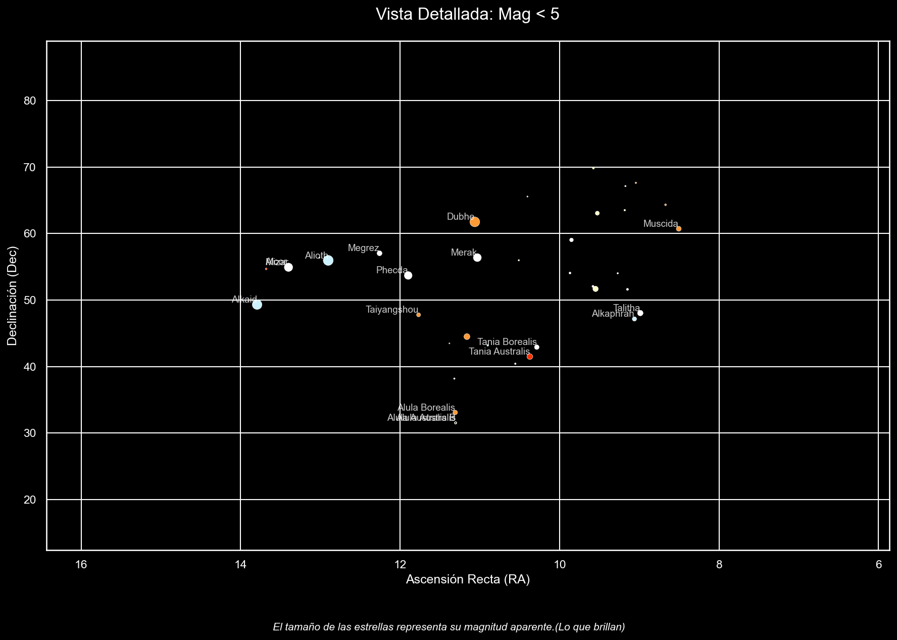

# Análisis astrométrico del catálogo HYG v4.2

Derivación y validación de propiedades físicas estelares a partir de un catálogo astrométrico de observaciones reales.


<!-- Sustituir por el diagrama HR exportado a img/diagrama_hr.png -->
<p align="center">
  
  <br>
  <em>Reconstrucción de la constelación de la Osa Mayor apartir de los datos.</em>
</p>

---

## Qué es esto

El catálogo HYG v4.2 contiene posición, magnitud y distancia de más de cien mil estrellas, pero **no contiene su
temperatura, su color, su tamaño ni su distancia en unidades legibles**. Este trabajo deriva esas cuatro variables
aplicando relaciones físicas conocidas, **las valida contra casos cuyo valor real se conoce de antemano**, y las usa
para responder a dos preguntas que el catálogo por sí solo no contesta.

Es un ejercicio completo de análisis de datos sobre un conjunto de observaciones reales: tratamiento de nulos con
lógica de dominio, decisión razonada sobre los valores atípicos, ingeniería de variables, visualización y sobre
todo delimitación explícita del rango en el que los resultados son fiables.

Realizado como proyecto del **Máster Universitario en Inteligencia Artificial** (Universidad Internacional de
Valencia). Calificación: sobresaliente.

## Preguntas que responde

| Pregunta | Método |
|---|---|
| ¿Son las constelaciones agrupaciones físicas reales o coincidencias visuales? | Dispersión de las distancias reales dentro de cada constelación, normalizada por coeficiente de variación |
| ¿Existe una "identidad térmica" característica de cada región del cielo? | Temperatura media por constelación, traducida a su color visual teórico |
| ¿Qué región del cielo concentra más estrellas de cada tipo espectral? | Agregación de doble nivel color × constelación |
| ¿Son fiables las propiedades derivadas de un catálogo de observaciones? | Casos de control, límites de plausibilidad física y análisis del error |

## Datos calculados (Nuevas variables)

Ninguna de estas variables venía en el catálogo de datos original. Todas se han calculado a partir de la información disponible:

* **Temperatura de la estrella:** Se calcula a partir de su color aparente.
* **Color para la visualización:** Se deduce a partir de su temperatura (las estrellas más frías son rojizas y las más calientes, azuladas).
* **Tamaño (radio) de la estrella:** Se calcula combinando cuánta luz emite (luminosidad) y su temperatura. El resultado se da tomando como referencia el tamaño de nuestro Sol (donde 1 = tamaño del Sol).
* **Distancia en años luz:** Convertimos la medida astronómica original (pársecs) a años luz para que sea más fácil de interpretar (1 pársec equivale a unos 3,26 años luz).
* **Nombre completo de la constelación:** Traducimos la abreviatura oficial en latín al nombre común en español.
* **Nombre de la estrella:** Se asigna siguiendo una regla de prioridad para elegir la mejor denominación disponible entre varios campos de nombres.

---

## Verificación de los datos

Para asegurarnos de que los cálculos son correctos, los contrastamos con cuatro pruebas independientes:

* **Prueba con el Sol:** Usamos las fórmulas con nuestro Sol para ver si daban el resultado correcto. La temperatura calculada dio casi exacta (5.757 K frente a los 5.772 K reales, un error de menos del 0,3 %) y el tamaño dio exactamente 1,000 (igual al radio solar).
* **Lista de estrellas más brillantes:** El orden de brillo resultante coincide perfectamente con las estrellas más deslumbrantes que vemos de noche: Sirio, Canopus, Arturo, Rigil Kentaurus y Vega.
* **Colores coherentes:** Los colores obtenidos coinciden con lo que sabemos de ellas: Sirio se ve blanco-azulada, Betelgeuse naranja y Antares roja.
* **Mapa de la vida de las estrellas (Diagrama HR):** Al graficar las estrellas por su temperatura y brillo, cada tipo (estrellas jóvenes, gigantes y enanas blancas) aparece ordenado en el lugar que le corresponde. Si las fórmulas hubieran fallado, mateniendo el grafico conocido.

---

## Principales hallazgos

**Las constelaciones son solo un efecto óptico, no grupos reales de estrellas.** 
Las estrellas de una misma constelación parecen estar juntas desde la Tierra, pero en realidad están a distancias profundas totalmente distintas. Para medir qué tan dispersas están sin que la distancia nos engañe, usamos un indicador relativo (que nos permite comparar agrupaciones cercanas y lejanas en igualdad de condiciones). Además, ignoramos las constelaciones con menos de 30 estrellas visibles para evitar conclusiones poco fiables por falta de datos.

**El catálogo tiene un sesgo histórico: está "mirando" hacia el norte.**
Las diez constelaciones con más estrellas registradas en este archivo (como la Osa Mayor, Casiopea o Pegaso) se ven desde el hemisferio norte. Esto no significa que en el sur haya menos estrellas, sino que los mapas astronómicos en los que se basa este estudio se crearon históricamente desde telescopios situados en el norte. Por tanto, las conclusiones reflejan las características de este catálogo en particular, no de todo el universo.

---

## Limitaciones a tener en cuenta

El método funciona bien en general, pero comete errores predecibles en casos específicos:

**El tamaño calculado no es preciso en estrellas muy frías, lejanas o tapadas por polvo.**
Por ejemplo, la estrella *Mu Cephei* nos da un tamaño equivalente a 51.000 soles, cuando los astrónomos saben que ronda los 1.000 o 1.500 soles. Esto ocurre por dos motivos que se suman:

1. **El polvo del espacio engaña a las fórmulas:** El polvo interestelar frena y enrojece la luz de las estrellas lejanas. Las fórmulas confunden este enrojecimiento con "poca temperatura", pensando que la estrella está más fría de lo que realmente está.
2. **Los errores se multiplican:** En la fórmula matemática utilizada, si la temperatura calculada es un 20 % más baja de la real, el tamaño resultante se dispara más de un 50 %.

**No hemos borrado los datos extremos.**
Decidimos conservar en el estudio incluso las estrellas con mediciones muy dudosas o lejanas para no eliminar información real por error. La consecuencia es que algunas cifras calculadas arrastran el margen de error propio de medir distancias tan gigantescas.

## Cómo reproducirlo

El catálogo no se incluye en el repositorio: es de terceros y pesa demasiado para el control de versiones.

```bash
git clone https://github.com/TU-USUARIO/hyg-star-catalog-analysis.git
cd hyg-star-catalog-analysis

python -m venv .venv && source .venv/bin/activate   # Windows: .venv\Scripts\activate
pip install -r requirements.txt

# Descarga del catálogo (≈ 3 MB comprimido)
curl -L -o hyg_v42.csv.gz https://www.astronexus.com/downloads/catalogs/hygdata_v42.csv.gz
gunzip hyg_v42.csv.gz

jupyter notebook 01MIAR_ACT_Rigel_Chulia_Ortega.ipynb
```

El notebook espera encontrar `hyg_v42.csv` en su mismo directorio.

## Estructura

```
.
├── 01MIAR_ACT_Rigel_Chulia_Ortega.ipynb  
├── requirements.txt
├── .gitignore                             
├── LICENSE
└── README.md
```

## Tecnologías

`Python` · `Pandas` · `NumPy` · `Matplotlib` · `Seaborn` · `Jupyter`

Análisis exploratorio de datos · tratamiento de nulos · análisis de valores atípicos · ingeniería de variables ·
agregaciones multinivel · visualización científica

## Datos y licencia

El catálogo **HYG v4.2** es obra de David Nash / [AstroNexus](https://www.astronexus.com/hyg) y se distribuye bajo sus
propios términos; consúltense en el origen antes de reutilizarlo. Este repositorio **no redistribuye el catálogo**:
únicamente documenta cómo obtenerlo.

El código y el análisis de este repositorio se publican bajo licencia MIT.

## Referencias

- Ballesteros, F. J. (2012). *New insights into black bodies*. EPL, 97(3), 34008.
- NASA. *Sun Fact Sheet* — temperatura efectiva de referencia del Sol.
- Agencia Espacial Europea (ESA) — sistema de magnitudes aparentes.

## Autor

**Rigel Chuliá Ortega** — Ingeniero de telecomunicaciones. Máster Universitario en Inteligencia Artificial (VIU).

[LinkedIn](https://www.linkedin.com/in/rigel-chuliá-ortega) · [rigelchulia@gmail.com](mailto:rigelchulia@gmail.com)

<details>
<summary><b>In English</b></summary>

### Astrometric analysis of the HYG v4.2 star catalogue

The HYG catalogue provides position, magnitude and distance for over a hundred thousand stars, but not their
temperature, colour, size or distance in readable units. This project derives those four properties from known
physical relations, validates them against cases whose true value is known, and uses them to answer two questions
the catalogue alone cannot.

**Derived variables:** surface temperature from the B−V colour index (Ballesteros relation), visual colour via Wien's
displacement law, stellar radius via Stefan-Boltzmann, and distance conversion from parsecs to light years.

**Validation:** the Sun as a control case (< 0.3 % temperature error), correct reproduction of the real apparent-magnitude
ranking of the brightest stars, physically consistent colour assignment, and a well-formed Hertzsprung-Russell diagram.

**Findings:** constellations are shown quantitatively to be line-of-sight groupings rather than physical associations,
measured through the coefficient of variation of member distances. The catalogue itself carries a strong northern-hemisphere
observational bias — the ten constellations richest in naked-eye stars are all northern — which constrains every
conclusion drawn from it.

**Known limitations:** derived radii are unreliable for cool, distant or reddened stars, since the Ballesteros relation
applies no interstellar extinction correction and the error propagates quadratically through Stefan-Boltzmann. Documented
in full in the notebook's conclusions.

`Python` · `Pandas` · `NumPy` · `Matplotlib` · `Seaborn` · EDA · feature engineering · scientific visualisation

</details>
